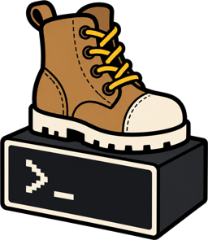
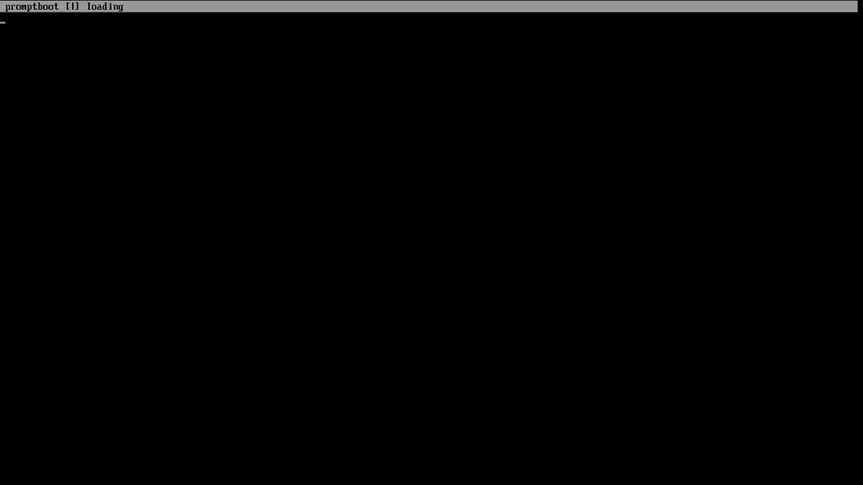

# promptboot

<p align="center">
  
</p>

**promptboot** is a freestanding x86-64 UEFI application that runs a frozen Qwen2.5-0.5B-Instruct Q4_0 model locally. It boots from a FAT image, reads prompts through the firmware console, performs single-core CPU inference, and streams the response back to the console. It does not need an operating system or network connection at runtime.

<p align="center">
  
</p>

Install Git, Make, Python 3, and rustup. QEMU and OVMF are needed to boot it locally.

```sh
make setup
make dev
make release
make play
```

`make setup` installs the pinned Rust toolchain and downloads verified model and reference inputs. It is the only normal command that uses the network. `make dev` runs the normal tests. `make release` requires a clean worktree. `make play` starts the release with KVM and a GTK window.

For a machine without KVM:

```sh
make play ACCEL=tcg
```

`make play` requires a graphical session with QEMU's GTK display support. QEMU is found through `PATH`. OVMF is discovered in common locations; set both `OVMF_CODE` and `OVMF_VARS` when it is installed elsewhere. Run `make help` for validation and USB commands.

The runtime accepts printable ASCII prompts up to 512 bytes and uses the model's native 32,768-token context. Each response may generate up to 1,024 tokens, bounded by the context remaining after the prompt, and stops earlier on either model stop token. Interactive decoding uses Qwen's temperature 0.7, top-k 20, top-p 0.8, repetition-penalty 1.1 configuration; the boot-session seed and sampler draw count are written to the structured runtime evidence so a run can be replayed. `/new` does not reset the pseudorandom sampler state to its original seed. Ctrl-C interrupts generation without committing the partial response. Conversation history and its evaluated KV state are kept only after a complete response, so the next prompt evaluates only the new turn; if history makes a prompt too large, history and cached inference state are cleared before the prompt is retried once. A visible cursor marks the live input position, while Page Up and Page Down navigate the bounded firmware-console scrollback. `/new` clears conversation state, cached inference state, and scrollback, `/help` displays the available commands, and `/events` toggles structured runtime events on the screen. Those events are also written to COM1 when the firmware exposes UEFI Serial I/O; a serial device is not required for physical boot. Commands are not sent to the model.

## Documentation

- [Development, release, QEMU, and USB](docs/development.md)
- [PBTQW25 v1 container format](docs/PBTQW25-v1.md)

## License

Copyright (C) 2026 Shimon Ulewicz

Original promptboot work is licensed under `GPL-3.0-or-later`; see [LICENSE](LICENSE). Third-party terms and attribution are in [THIRD_PARTY_NOTICES.md](THIRD_PARTY_NOTICES.md).
